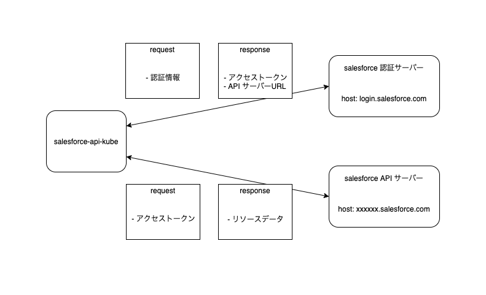

# salesforce-api-kube

## 概要
salesforce-api-kubeは、Salesforce との API 連携を担当するサービスです。  
Status-Kanban からメッセージを受信すると、Status Kanban, redis-cluster に書き込みをして、Salesforce に読み込み・書き込みを行います。  

## 動作環境
salesforce-api-kube は AIONのプラットフォーム上での動作を前提としています。  
使用する際は、事前に AION の動作環境を用意してください。  

OS: Linux  
CPU: Intel/AMD/ARM  
Kubernetes  
AION  

## 通信フロー  



salesforce-api-kube の通信フローは下記の通りです。  

1. 認証サーバーへクレデンシャルを送信し、api へのアクセストークンと API の URL を取得する。
2. 1 で取得した API URL に対して、アクセストークンをヘッダーに付与しリクエストを送信する。

アクセストークンは有効期限が設定されており、有効期限が切れるまでは再取得する必要がありません。  
しかし、現状トークンを保持する仕組みが無いため、 API へのリクエスト毎に毎回取得する仕組みになっています。  

## salesforce クレデンシャル  
`config.json.sample` のフォーマットを参考に、  
`config.json` に salesforce のクレデンシャルを記載してください。  
アプリケーション起動時に、自動でクレデンシャルが読み取られます。  

## sand box での実行  
下記の設定を行う事で接続先を salesforce sand box に切り替える事ができます。  
1. `config.test.json` に sand box のクレデンシャルを記載する。
2. 環境変数 DEV=true で起動する。
環境変数を変更する事で、`config.json.sample`からクレデンシャルを読み込みます。  

## セットアップ  
このリポジトリをクローンし、makeコマンドを用いてDocker container imageのビルドを行ってください。  
```
$ cd salesforce-api-kube
$ make docker-build
```

## kanban との通信  
### kanban から受信するデータ  
kanban から受信する metadata に下記の情報を含む必要があります。  

| key | type | description |
| --- | --- | --- |
| connection_key | salesforce-api-kube がデータを送信すべきマイクロサービスの connection_key |
| method | string | 使用する HTTP メソッド |
| object | string | 操作対象の Salesforce オブジェクト |
| path_param | string | パスパラメータ (必要な場合のみ)|
| query_params | map[string]strnig | クエリパラメータ (必要な場合のみ)|

path_param, query_params は必要な場合のみ含まれます。  

具体例:   
```example
# metadata (map[string]interface{}) の中身

"connection_key": "account_get"
"method": "get"
"object": "Account"
"path_param": "15"
```

### kanban に送信するデータ  
kanban に送信する metadata に下記の情報を含める必要があります。  

| key | value |
| --- | --- |
| connection_type | 文字列 "response" を指定 |
| key | 送信するデータの Object 名 |
| content | 送信するデータの中身 |

具体例:  
```example
# metadata (map[string]interface{}) の中身

"connection_type": "response" 
"key": "Account"
"content": `[{
    "attributes": {
        "type": "Account",
        "url": "/services/data/v51.0/sobjects/Account/0010I000028S9KmQAK"
    },
    "Id": "xxxxxxx",
    "Name": "サンプル太郎",
    "LastName": "サンプル",
    "FirstName": "太郎",
    "CustomerNameKana__c": "サンプル　タロウ",
    "PersonEmail": "sample25a@gmail.com", 
    "KokyakuStatus__c": "契約中（継続）",
    "Phone_nohyphen__c": "041234567",
    "MailingAddress__c": "000-0000 神奈川県XXXX市",
    "todoufukenSikugun__c": "神奈川県XXXX市"
}]`
```
